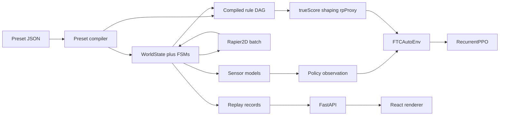

# TalonGym Architecture and Implementation Plan

**Status:** buildable specification for a greenfield rewrite.  
**Flagship season:** BIOBUZZ™ presented by RTX, 2026–2027, Competition Manual **V1**.  
**This document is the source of truth for implementation.** JSON Schema files in [`../schemas/`](../schemas/) are normative for preset files.

**Deployment path (always and only):** train offline → export a trajectory → paste into an AUTO OpMode → Control Hub runs that OpMode. Intended-use boundary, hardware modes, and official source links: [README.md](../README.md). Kickoff procedure: [NEW_SEASON_RUNBOOK.md](NEW_SEASON_RUNBOOK.md).

---

## 1. Executive summary

TalonGym is a **season-plugin, Gymnasium-first** FTC Autonomous trainer with a React/Three.js viewer that never runs physics. The engine default is **2.5D** planar contacts. BIOBUZZ AUTO opts into a **MuJoCo mesh field** because launches into elevated CELLs must arc. A team loads a field + robot + scoring-rules preset, trains a policy offline, inspects rollouts, and exports Road Runner 1.0 Actions to paste into an AUTO OpMode. The Control Hub runs that OpMode; TalonGym does not command a robot during a MATCH. “Best” is a **pre-registered statistical objective** over ≥500 held-out trials, never a single lucky episode.

### Decisions (not a menu)

| Decision | Choice | Why |
|----------|--------|-----|
| Physics | **2.5D default** (Rapier2D / planar contacts + scoring volumes). BIOBUZZ sets `mesh_field_collision` and runs **MuJoCo 3D** (Y-up inches) against CAD-derived colliders. | BIOBUZZ AUTO is launch-into-cell; robots must drive under the hive. Missing MuJoCo **refuses** a mesh-field training run — no silent planar fallback. |
| Rapier vs Box2D | **Project-owned Rapier2D batched PyO3 ABI**, with a **Phase 0 benchmark gate** and Box2D v3 subprocess fallback | Off-the-shelf Box2D v3 Python bindings are early and one-world-per-call. Official Rapier Python packages are unpublished. A narrow batched `step(n_worlds)` is the only path to the throughput budget. If the Rust spike slips, drop to Box2D workers rather than inventing a third engine. |
| 3D physics | **Opt-in `MujocoFieldBackend`** when the field declares `collisionAsset` / `mesh_field_collision`. The old chassis-only adapter remains for `talongym validate-3d`. | Required for ballistic CELL launches. Viewer still does not run physics. |
| Action space MVP | **High-level waypoint / spline** executed by a Road Runner-like follower | Trains faster; maps onto exportable RR 1.0 segments. Low-level `(vx, vy, ω)` is Phase 5 transfer/validation. |
| Algorithm | **BIOBUZZ:** `bc_then_ppo` (scripted clone, then asymmetric-critic PPO). Optional `grpo` for sparse TIP. Actor stays encoder-only. | Scratch LSTM PPO does not learn a 30s +20 TIP. 2025–26 robot RL is BC then on-policy RL, often with a privileged critic or group baseline. Not a VLA. |
| Frontend | React + react-three-fiber; FastAPI BFF; **no localStorage** | Matches the product requirement. Persistence is SQLite (MVP) → Postgres (Phase 5). |
| Multi-agent | Gymnasium single-agent MVP; **PettingZoo parallel API** from Phase 4 | Two robots per alliance is real; it is not the first learning problem. |
| Export | **Road Runner 1.0 `TrajectoryActionBuilder` / Actions** default; 0.5.x `TrajectorySequence` as compatibility | RR 1.0 replaced trajectory sequences. Emitting deprecated APIs as the primary path would strand teams. |
| POLLEN size | **2.8 in** (Competition Manual V1 §9.8) | Pre-Kickoff planning notes said ~3 in; the manual is 2.8 in. |

### What 2.5D means, precisely

- **Simulated in Rapier2D:** chassis vs walls, chassis vs chassis, floor pieces vs floor pieces, floor pieces vs chassis (pushing). Gravity is off in-plane; friction and restitution are data.
- **Not simulated as rigid-body flight by default:** a piece “in the goal” can be an FSM (`held → launched → in_goal_volume → scored`) with timers. BIOBUZZ uses ballistic launches against the mesh when `ballistic_launch` is unlocked; `retained_queue` remains an engine capability for seasons that need an ordered overflow buffer.
- **Visualizer:** extrudes `WorldState` (2D poses + FSM + queue) into meshes. It is a renderer.

---

## 2. Repository / folder structure

Greenfield layout. Do not preserve a zone-based kinematic lab as the physics core.

```
talongym/
  README.md
  docs/
    ARCHITECTURE.md          # this file
    NEW_SEASON_RUNBOOK.md
  schemas/                   # Draft 2020-12 JSON Schema (normative)
    field-preset.schema.json
    robot-preset.schema.json
    scoring-rules-preset.schema.json
    training-run-config.schema.json
    api/                     # OpenAPI fragments live here when generated
  presets/
    seasons/
      biobuzz_2026/          # V1 flagship
    robots/
      mecanum_meepmeep_defaults.json
      mecanum_biobuzz_4cap.json
    training/
      biobuzz_auto_{lightweight,workstation,cloud,easy}.json
  assets/
    seasons/biobuzz_2026/    # field.glb (Lab) + field_mjcf.xml (MuJoCo); no raw STEP
  engine/                    # Rust crate: Rapier2D batched worlds
    Cargo.toml
    src/lib.rs
  python/
    talongym/
      sim/                   # WorldState, PhysicsBackend protocol, Rapier bindings, Box2D fallback
      rules/                 # compile ScoringRulesPreset → DAG, evaluate per tick
      robot/                 # drivetrain FK/IK, motor model, sensors, mechanism FSMs
      env/                   # FTCAutoEnv, wrappers, PettingZoo
      training/              # RecurrentPPO loop, vectorization, curriculum, ONNX export
      eval/                  # statistical harness, reports
      export/                # RR 1.0 Actions + optional 0.5.x sequence
      api/                   # FastAPI app, jobs, sqlite
      calibrate/             # real-log kinematics fit
  web/                       # React + Vite + R3F
    src/
      routes/                # replay, train, field-builder, robot-builder, compare
      scene/                 # Three.js field; no physics
      api/
  tests/
    engine/
    env/
    rules/
    api/
    presets/
  ftc/                       # optional on-robot notes; exported Java/Kotlin snippets are generated, not hand-maintained
```

### Layer contracts (pure, no cycles)



- `WorldState` is the simulation source of truth.
- The web client **never** integrates physics or scoring.
- Ground-truth motif / randomized match variables are **not** fields on the observation dict unless the matching `observeVia` sensor has fired.

### Engine primitives (strict superset target)

The engine implements only these capabilities. Seasons declare which they need. Adding a season must not add a BIOBUZZ-shaped code path.

| Capability id | Meaning |
|---------------|---------|
| `planar_drive` | Mecanum / tank / swerve on a flat field |
| `static_colliders` | Walls and field elements |
| `dynamic_game_pieces` | Disk/circle bodies with type ids |
| `trigger_volumes` | Enter/exit events, scoring and mechanism |
| `occluders` | Block vision rays (OBELISK, truss, submersible, …) |
| `apriltag_vision` | FOV cone, range, occlusion, tag id |
| `randomized_match_variable` | Per-reset enum/int drawn from preset domain |
| `partial_observability_sentinel` | `not_yet_observed` until `observeVia` |
| `n_stage_scoring` | Accumulators + sequenced conditions |
| `end_of_phase_scoring` | `phaseEnd` trigger |
| `alliance_aggregate_scoring` | `allAlliance` / `anyAlliance` |
| `ranking_point_thresholds` | Threshold tables; UI must say AUTO proxy |
| `mid_episode_geometry_change` | Lock/swap colliders (rare; Centerstage door analog) |
| `retained_queue` | Ordered slots with overflow |
| `scripted_mechanism_fsm` | Named FSMs parameterized by robot/field data |
| `multi_robot_collision` | 2–4 chassis contacts + penalty hooks |
| `phase_clock` | AUTO / TRANSITION / TELEOP timers |
| `mesh_field_collision` | 3D CAD/MJCF colliders + ballistic pieces (BIOBUZZ). Requires MuJoCo. |

---

## 3. Preset schemas

Normative JSON Schema:

- [`schemas/field-preset.schema.json`](../schemas/field-preset.schema.json)
- [`schemas/robot-preset.schema.json`](../schemas/robot-preset.schema.json)
- [`schemas/scoring-rules-preset.schema.json`](../schemas/scoring-rules-preset.schema.json)
- [`schemas/training-run-config.schema.json`](../schemas/training-run-config.schema.json)

Instance data lives under `presets/`. Example instances:

- [`presets/seasons/biobuzz_2026/field.json`](../presets/seasons/biobuzz_2026/field.json)
- [`presets/seasons/biobuzz_2026/scoring.json`](../presets/seasons/biobuzz_2026/scoring.json)
- [`presets/robots/mecanum_biobuzz_4cap.json`](../presets/robots/mecanum_biobuzz_4cap.json)
- [`presets/training/biobuzz_auto_lightweight.json`](../presets/training/biobuzz_auto_lightweight.json) (workstation / cloud / easy siblings)

**Rule:** season nouns (ARTIFACT, MOTIF, POLLEN, SAMPLE, PIXEL) appear only in instance `type` / `id` / `explain` strings, never as Python/Rust identifiers in `engine/` or `python/talongym/sim/`.

### Coordinate system (locked)

Use the official FTC field coordinate system:

- Origin: field center, tile surface.
- +X: right when standing at the Red Wall looking at field center.
- +Y: away from the Red Wall.
- +heading: counter-clockwise.
- Units in presets and exports: **inches**.
- Viewer convention: MeepMeep-style **non-rotated** Cartesian. Do not store audience-rotated poses.

The Red Wall definition still holds for BIOBUZZ. Document alliance-specific notes in the field preset `coordinateSystem.notes`.

### BIOBUZZ scoring (preset data; verify)

From Competition Manual V1 Table 10-2. **Re-verify at implementation time.** Details: [presets/seasons/biobuzz_2026/README.md](../presets/seasons/biobuzz_2026/README.md).

| Achievement | AUTO points | Notes |
|-------------|-------------|--------|
| LEAVE | 3 | Assessed at end of AUTO if the ROBOT is in `leave_interior` |
| PARK | 5 | At least partially in the LOADING ZONE |
| HIVE TIP | 20 | Placeholder threshold: 7 in the upward CELL (3 staged NECTAR + 4 launched) |

CELL / FLOWER / GARDEN points are end-of-match only — model in the graph as `enabledPhases: ["TELEOP"]` but do not train on them in MVP.

RP thresholds (Table 10-3) are **match-wide**. AUTO-only training may optimize a **proxy** (LEAVE+PARK, tip count). The UI must never label that proxy “Ranking Points earned.”

POLLEN is 2.8 in yellow; NECTAR is 3.6 in red/blue. Preload 4 POLLEN per ROBOT.

AprilTags are 36h11 clusters on CELL bottoms. Manual extract confirmed ids 0, 7, and 38–41; 1–3, 4–6, and 42–45 are inferred.

---

## 4. Gymnasium environment interface

### `FTCAutoEnv`

```python
class FTCAutoEnv(gymnasium.Env):
    metadata = {"render_modes": ["rgb_array", "none"], "render_fps": 25}

    def reset(self, *, seed=None, options=None) -> tuple[ObsDict, InfoDict]: ...
    def step(self, action) -> tuple[ObsDict, float, bool, bool, InfoDict]: ...
```

`options` may set `alliance`, `start_slot`, `opponent_mode`, `action_tier` override, `determinism_stream` (`"train"` | `"eval"`).

**Control rate:** 25 Hz default (preset `episode.controlHz`; legal 20–50). Physics substeps: 2 (50 Hz Rapier) unless the Phase 0 bench says otherwise. Episode length: **30.0 s AUTO**, then truncation. TRANSITION (8 s official; 15 s at FIRST Championship) is **not** simulated in MVP; end-of-AUTO scoring uses the AUTO `phaseEnd` hook with a configurable `settle_time_s` (default 0.5 s) to stand in for “come to rest.”

### Observation space (`Dict`) — policy-visible only

All arrays `float32` unless noted. Missing detections are zero with a validity mask. **No pose ground truth. No unread match variables.**

| Key | Shape | Content |
|-----|-------|---------|
| `pose_noisy` | (3,) | Encoder/odometry `x_in, y_in, heading_rad` with configured Gaussian + slip. |
| `vel_noisy` | (3,) | `vx, vy, omega` from encoders/IMU. |
| `time_remaining_s` | (1,) | AUTO clock. |
| `held_count` | (1,) | Integers stored as float. |
| `held_colors` | (C,) | One-hot-ish slots; C = robot `mechanisms.capacity`. Unknown color = zeros. |
| `nearest_pieces` | (K, 6) | Up to K pieces in radius: `rel_x, rel_y, type_id_norm, color_id, valid, held_by_other`. |
| `triggers` | (T,) | Occupancy of named trigger volumes the robot can sense (bumpers, intake). |
| `vision_tags` | (M, 5) | `tag_id_norm, bearing, range, visible, occluded`. |
| `match_var_obs` | (V, E+1) | For each observable match variable: one-hot over domain **plus** sentinel channel `not_yet_observed`. Ground truth is **not** copied here at t=0. |
| `teammate_pose_noisy` | (3,) | Zeros in single-agent mode; still present so the space is stable. |
| `collision` | (1,) | 1 if in contact with wall/robot this step. |

`K, T, M, V, C, E` are compiled from the active presets so a BIOBUZZ preset can change them without env class edits. `observation_space` is rebuilt at `reset` only if presets change (training run pins presets).

**Privileged info** (eval, shaping, replay overlays) lives in `info["privileged"]` and is stripped by `EncoderOnlyObsAssertWrapper` before `model.learn`. Tests fail the suite if `match_var_obs` sentinel is false while the vision model reports the motif tag not visible.

### Action spaces

**Tier A — MVP `high_level_waypoint`**

`Dict`:

- `target_pose`: `Box` shape (3,) in inches / radians, clipped to field + margin.
- `speed_frac`: `Box` (1,) in [0.2, 1.0].
- `mechanism`: `Discrete(N)` compiled from robot FSM verbs (`idle`, `intake`, `score`, `open_gate`, `stow`, …).

A follower (pure pursuit + heading PID, constraints from the robot preset) consumes `target_pose` until the next env step **or** until the waypoint is reached, whichever first. The policy therefore emits a moving target at 25 Hz, which is enough to represent splines after export decimation.

**Tier B — `low_level_velocity` (Phase 5)**

`Box(3,)` = `(vx, vy, omega)` in in/s and rad/s, clipped by motor model (torque-speed curve + current limit). Mecanum inverse kinematics inside the drivetrain plugin. Tank ignores `vy`. Swerve solves module states.

### Reward signature

```python
@dataclass
class RewardBreakdown:
    true_score_delta: float      # official points this step (usually 0 until events)
    shaping: float               # progress, time cost, collision — NOT on the leaderboard
    objective: float             # what PPO actually maximizes (configurable mix)
```

`step` returns `reward = breakdown.objective`. `info["true_score"]` is the running official AUTO score. `info["shaping"]` is logged and plotted on a **separate** chart. Leaderboard and “statistically best” use **only** `true_score` (or the pre-registered objective of true_score / LCB / RP-proxy).

Default shaping (coefficients in the training config, not the scoring preset):

- +progress along the AUTO plan (potential difference): while loaded, the drive to the alliance `launch_spot` plus the drive from there to the park zone; once empty, the drive to the park zone. Routes go around colliders. The two distances match at the launch spot, so launching there is neither rewarded nor charged. Fields without a launch spot or park zone fall back to the goal and the nearest reachable piece.
- −0.01 per second (time cost).
- −0.5 on wall contact impulse above threshold; −2.0 on robot-robot contact.
- −2.0 per launch that has scored nothing within 2 s (`LAUNCH_SCORE_WINDOW_S`). Without it PPO reinforces firing a little earlier, which scores near the launch spot, while misses farther out only cost a delayed lost threshold.
- 0 motif bonus in shaping (avoid leaking). Pattern points arrive only via the rule DAG at `phaseEnd`.

### `reset` / `step` semantics

**reset**

1. Seed NumPy + Rapier world from `seed`.
2. Draw match variables (motif, etc.).
3. Spawn pieces, robots (legal start slots), randomize build tolerance.
4. Zero all sensors’ observed-match-var flags.
5. Evaluate rule DAG `alwaysTick` once (should be no points).
6. Return obs with sentinel on unread variables.

**step**

1. Clip action; follower or IK → wheel forces / velocities.
2. Rapier `step` × substeps.
3. Advance mechanism FSMs (timers, trigger volumes).
4. Sensor models (vision last, using updated poses + occluders).
5. Rule DAG: triggers this tick → conditions → actions → score channels.
6. `terminated = False` for AUTO (no absorbing win). `truncated = time >= 30s` after `phaseEnd` scoring.
7. Illegal action (NaN) → `terminated=True`, true_score unchanged, objective −10 (training only).

### Recurrent state

`RecurrentPPO.predict(obs, state=lstm_states, episode_start=done)`. VecEnv must set `episode_start` on truncate. Do not carry LSTM across episodes.

### PettingZoo (Phase 4)

`FTCAutoAECEnv` / `parallel_wrapper` with agents `red_0`, `red_1`, `blue_0`, `blue_1`. Shared alliance reward optional. Single-agent Gym is `FTCAutoEnv` with teammate/opponents from `TrainingRunConfig.presets.teammatePolicy` / `opponentPolicy`.

---

## 5. API contract

Base URL: `/api/v1`. Auth: none for local MVP; later a team token. **No browser storage.** All presets, runs, and reports are SQLite rows.

Error envelope:

```json
{ "error": { "code": "PRESET_STALE", "message": "...", "details": {} } }
```

HTTP: 400 validation, 404 missing, 409 job conflict, 422 schema, 503 worker busy.

### REST

| Method | Path | Purpose |
|--------|------|---------|
| GET | `/health` | `{ "ok": true, "engine": "rapier2d", "capabilityVersion": 1 }` |
| GET | `/presets/field` | List field presets (id, season, manualRevision, stale) |
| POST | `/presets/field` | Create; body = FieldPreset JSON; 201 |
| GET | `/presets/field/{id}` | Full document |
| PUT | `/presets/field/{id}` | Replace; bump revision |
| DELETE | `/presets/field/{id}` | 204 if unused; 409 if referenced by a run |
| GET/POST/PUT/DELETE | `/presets/robot` … | Same for RobotPreset |
| GET/POST/PUT/DELETE | `/presets/scoring` … | Same for ScoringRulesPreset |
| POST | `/presets/validate` | `{ "kind": "field"|"robot"|"scoring"|"training", "document": {} }` → `{ "ok", "errors", "unsupportedCapabilities" }` |
| GET | `/runs` | Training runs |
| POST | `/runs` | Body = TrainingRunConfig; enqueues job; 202 `{ "runId" }` |
| GET | `/runs/{id}` | Status, hyperparams, latest metrics, artifact ids |
| POST | `/runs/{id}/cancel` | Cooperative cancel |
| GET | `/runs/{id}/artifacts` | List (ckpt, onnx, replay, report, export) |
| GET | `/artifacts/{id}` | Download |
| POST | `/evaluations` | `{ "policyArtifactId", "nTrials", "objective" }` → 202 |
| GET | `/evaluations/{id}` | Report with CIs; `bestLabelEligible: bool` |
| GET | `/comparisons/{id}` | Ranked evaluations; no “best” if overlapping CIs |
| GET | `/replays/{id}` | Metadata (duration, hz, preset hashes) |
| GET | `/replays/{id}/chunks?fromStep=&limit=` | Array of `WorldState` frames (max 500/request) |
| POST | `/replays/{id}/export/roadrunner` | `{ "dialect": "rr1_actions" }` → text/plain Java |
| POST | `/runs/{id}/export/onnx` | 202; 501 if policy is LSTM and ONNX path unsupported (see risks) |

Layout/field-builder autosave uses PUT on the field preset, not a separate undocumented blob.

### WebSocket

`GET /api/v1/ws/runs/{runId}` (upgrade).

Envelope:

```json
{
  "v": 1,
  "type": "metrics|status|rollout|log|error|ping",
  "seq": 1842,
  "ts": "2026-09-08T16:00:00.000Z",
  "payload": {}
}
```

- `status`: `{ "state": "queued|running|cancelling|succeeded|failed", "step": 0, "nEnvs": 32 }`
- `metrics`: `{ "envSteps", "objectiveMean", "trueScoreMean", "shapingMean", "entropy", "approxKl" }` — **true vs shaping always separate keys**
- `rollout`: downsampled `WorldState` (every Nth control step, N=5 default) for the live 3D view. If the client `seq` lags >500, server sends `{ "type": "error", "payload": { "code": "BACKPRESSURE", "resumeFrom": seq } }` and drops frames.
- `log`: `{ "level", "message" }`
- Client → server: `{ "v":1, "type":"ack", "seq": 1842 }` and `{ "v":1, "type":"setRolloutHz", "payload": { "every": 10 } }`

Resume: reconnect with `?afterSeq=`.

### Frontend routes (React Router)

| Route | View |
|-------|------|
| `/replay/:replayId?` | 3D field, robot(s), pieces, FSM overlays, MeepMeep-style scrub, play/pause/speed, FOV cones, planned path, optional reward heatmap |
| `/train/:runId?` | Dashboard: true-score curve, shaping curve (clearly labeled not-leaderboard), success rate, score histogram, hyperparams, live scene |
| `/build/field` | Grid editor, import background image/CAD-derived JSON, season templates |
| `/build/robot` | Drivetrain, MeepMeep constraint sliders, sensors, mechanism capacity/cycle times |
| `/compare` | Leaderboard of evaluations with CI whiskers; Export RR per row |

Stale preset: if `provenance.manualRevision` is older than `engine.latestKnownManual[season]`, banner: “Preset matches V1; a newer Team Update exists.”

---

## 6. Phased roadmap

### Phase 0 — Foundation benchmark (done when)

- Schemas frozen at `1.0.0`; compiler rejects unknown capabilities.
- Rapier batched stepping **or** documented fallback to Box2D workers.
- **Throughput gate (measure, then lock):**
  - Lightweight laptop: **≥ 5×10³** control-steps/s at 8 envs, BIOBUZZ single robot, no viewer.
  - Workstation 16-core: **≥ 5×10⁴** control-steps/s at 256 envs.
  - If Rapier spike misses 50% of workstation gate after two weeks, ship Box2D fallback and do not block Phase 1.
- Deterministic replay: same seed + action log → bit-stable poses at 1e-4 in.
- BIOBUZZ field + scoring presets compile; provenance fields populated; `verifyAgainstManual` still true until mentor sign-off.
- No frontend physics.

### Phase 1 — Single-robot vertical slice (MVP product)

- BIOBUZZ AUTO, high-level actions, mesh field, LEAVE / PARK / HIVE TIP.
- RecurrentPPO, lightweight + workstation profiles.
- SQLite jobs, WS telemetry, `/replay` + `/train`.
- Evaluation report: n=500, bootstrap 95% CI, objective `mean_true_score`.
- RR 1.0 Actions export from a decimated waypoint log.
- **Done:** a student can train overnight on a desktop, scrub the best mean-score rollout, and paste Java into an AUTO OpMode for the Control Hub.

Time-to-useful-policy is a **measured** number after Phase 1, not a promise. Planning target to hold the design honest: workstation reaches mean AUTO score **strictly above a scripted “leave + park” baseline** within **4 hours** wall clock at the workstation env count. If missed, cut shaping bugs and n_envs before adding more 3D physics.

### Phase 2 — Season tooling

- `/build/field` and `/build/robot`; scoring graph editor (node list + lint, not a free-form script box).
- Stale-version banners.
- Season-agnostic regression: new games as volumes + end-of-AUTO scoring; **no season nouns in engine identifiers**.
- Randomization seasons use `matchVariables` + `sequenceEquals` when needed.
- Runbook executed dry on a fake “season X” fixture in CI.

### Phase 3 — Multi-agent rigor

- PettingZoo cooperative red alliance; scripted then frozen-policy opponents.
- Collision / right-of-way metrics in the report (contact-seconds, first-contact time, G402-style “entered opponent side” flag as a **data rule**, not a hardcoded season name).
- Paired CRN comparisons; “best” suppressed when CIs overlap.

### Phase 4 — (renumbered in exec summary as Phase 4/5) Transfer and scale

Keep the plan-file numbering mapped as:

- Plan-file Phase 4 ≈ this Phase 3 (multi-agent).
- Plan-file Phase 5 ≈ this Phase 4: low-level velocity, real-log calibration, ONNX demo for feed-forward clone of the follower targets (LSTM ONNX best-effort), Ray/RLlib, self-play, Postgres + job queue, optional MuJoCo validation mode.

---

## 7. Risks and mitigations

1. **Rapier Python ABI slips.** Mitigation: Phase 0 time-box; Box2D v3 process pool with shared-memory states; keep `PhysicsBackend` protocol tiny (`reset_batch`, `step_batch`, `contacts`).
2. **Policy cheats motif.** Mitigation: unit tests that mutate privileged motif without moving the robot/camera and assert obs unchanged; curriculum that starts with `motif_known_at_t0` then disables it.
3. **Shaping optimizes the wrong game.** Mitigation: leaderboard binds to `true_score`; freeze shaping coefficients in the run config hash; abort train if true_score and objective diverge past a threshold for 1e6 steps.
4. **Sim-to-real gap on launch.** Mitigation: ballistic launches use the mesh field when unlocked; launch success can also be a Bernoulli + heading/range model fit from team logs (`calibrate/`). MuJoCo is required for BIOBUZZ training — no silent planar fallback.
5. **LSTM ONNX / in-browser demo is lossy.** Mitigation: the only field path is (a) follower waypoint sequence pasted into an AUTO OpMode the Control Hub runs; (b) ONNX of a distilled feed-forward policy is a demo only. Do not claim on-robot NN inference.
6. **Multi-robot collisions ignored in MVP then surprise in quals.** Mitigation: even single-agent MVP spawns a **static** teammate bounding box by default (configurable off) and penalizes contact.
7. **Mid-season Team Updates silently desync.** Mitigation: `manualRevision` + hash on every preset; UI stale banner; evaluations store preset hash immutably.
8. **Laptop cannot train.** Mitigation: lightweight profile + “import a run the mentor trained” via SQLite file copy; cloud path documented, not required.

---

## 8. Open questions for an FTC mentor (BIOBUZZ freeze)

Do not treat the following as engine work. They are **preset sign-off** questions. Until answered, keep `verifyAgainstManual: true`. Full checklist: [MENTOR_SIGNOFF.md](MENTOR_SIGNOFF.md).

1. Confirm Table 10-2 AUTO values still 3 / 5 / 20 for LEAVE / PARK / HIVE TIP.
2. Confirm HIVE TIP threshold (preset uses 7 in the upward CELL) against CAD / Field Setup Guide.
3. Confirm AprilTag cluster ids against official artwork (0, 7, 38–41 confirmed; 1–3, 4–6, 42–45 inferred).
4. G402 (no AUTO opponent-side interference): **encoded as a scoring/foul node.** Restricted-volume entry `addScore`s −15 on `trueScore` (training proxy for opponent Major Foul; VERIFY AGAINST MANUAL). The flag still feeds `restrictedEntryRate`. Replay highlights the foul; wall/robot contact stays shaping-only.
5. Championship 15 s transition vs 8 s: ignore for AUTO policy training?
6. Which optimization objective should the default leaderboard use for *your* team: mean match points, 10th percentile (robust), or RP-proxy probability (SWARM ≥ 16, POLLINATOR 1/2 — **verify Table 10-3**)?
7. Legal start poses for your region’s typical field build: which start slots are actually used in AUTO?

---

## Sim-to-real, collisions, statistics, performance (must-not-overlook)

### Simulated vs approximated

| Phenomenon | Modeled as |
|------------|------------|
| Planar holonomic / tank motion | Motor-limited 2D rigid body |
| Wall / robot / piece push | Rapier contacts |
| Intake capture | Volume + cycle timer + capacity |
| Launch / score | Trigger path + optional ballistic mesh |
| Vision / match vars | FOV, range, occluder rays, false-negative rate |
| Launch ballistics | BIOBUZZ: 3D muzzle velocity vs mesh field when `ballistic_launch` is unlocked |
| Foam tile compliance | Optional friction DR, not FEM |
| Battery sag | Optional; off in lightweight |

**Calibration workflow:** ingest FTC Dashboard / WPILOG pose streams from a few real AUTOs; fit `maxVel`, `maxAccel`, slip noise, and intake cycle time so simulated encoder traces match within a reported RMSE. Store the fit as a robot-preset overlay, not a fork of BIOBUZZ rules.

### Multi-robot right-of-way

Contact events increment `collision_time_s` and apply shaping penalty. Eval report includes collision rate. Cooperative Phase 3 adds a shared “who claimed this spike mark” accumulator teams can put in the rule graph if they want explicit coordination rewards — still data, not engine.

### Statistical rigor

- Pre-register `objective` on the training run.
- ≥500 held-out seeds, disjoint from training.
- Pair candidates with common random numbers (same motif, same piece jitter) when comparing.
- Bootstrap 95% CI on the objective.
- Holm correction if ranking >2 policies.
- `bestLabelEligible: false` when CIs overlap or nTrials < 500.
- Report mean, median, p10, p90, min of **true_score**.

### Performance budget (acceptance, not folklore)

| Profile | n_envs | Control Hz | Gate |
|---------|--------|------------|------|
| lightweight_cpu | 8 | 25 | ≥5e3 steps/s; 30 s AUTO replay export ≤ 2 s |
| workstation | 256 | 25 | ≥5e4 steps/s; 4 h to beat scripted baseline (Phase 1 target) |
| Memory | — | — | ≤ 8 GB laptop / 32 GB workstation for the above n_envs |

Final numbers are **locked after Phase 0 measurement**.

### Accessibility

Lightweight CPU path is first-class. Cloud is optional. UI copy must not assume a GPU.

### Extensibility self-check

Engine identifiers are capability names and geometry kinds (`aabb`, `volumeEnter`, `retained_queue`). If a grep of `engine/` plus `python/talongym/sim` plus `python/talongym/rules` for `artifact|obelisk|motif|pollen|specimen|pixel` returns hits outside tests/comments, the PR fails CI.

---

## Drivetrain, motors, sensors (robot model)

- Plugins: `mecanum` (default), `tank`, `swerve`.
- Forward/inverse kinematics in `python/talongym/robot/`.
- DC motor: linear torque-speed, clip to `currentLimitA`. No infinite acceleration.
- Encoders: Gaussian noise + slip; separate `ground_truth` pose for rewards/eval only.
- AprilTag camera: pinhole FOV cone, max range, ray vs `isOccluder` elements (BIOBUZZ hive frame + CELL tag clusters).

---

## Road Runner export (required, not stretch)

This is the only match-bound artifact. Teams paste the Java into an AUTO OpMode; the Control Hub runs it. Do not stream the policy or load a neural net onto the robot.

From a rollout of high-level targets, decimate to a polyline with heading, then emit Java:

```java
Actions.runBlocking(
    drive.actionBuilder(new Pose2d(startX, startY, startHeading))
        .splineToLinearHeading(new Pose2d(x1, y1, heading1), tangent1)
        // ...
        .build());
```

Dialect `rr05_trajectory_sequence` emits legacy `trajectorySequenceBuilder` for teams not on 1.0. Units: inches. Coordinate system: same as MeepMeep / official FTC.

---

## Capability regression matrix

| Need | BIOBUZZ V1 |
|------|------------|
| Planar drive + walls | yes |
| Game pieces | POLLEN 2.8 in, NECTAR 3.6 in |
| Randomized match var + sentinel | none (AUTO) |
| Occluders + vision | hive frame + cells (AprilTag clusters) |
| N-stage + pattern/derived | launch count then HIVE TIP |
| End-of-AUTO scoring | LEAVE, PARK, HIVE TIP |
| Retained queue | no |
| Alliance aggregate | SWARM RP (LEAVE+PARK) |
| Mid-episode geometry | hive tip modeled as accumulator, not collider swap |
| Climb / vertical FSM | no AUTO |

BIOBUZZ is the only shipped season. A new season is data under `presets/seasons/` following the runbook; CI capability lint must pass with **zero files under `engine/` changed** unless a new primitive is required.

---

## Implementation notes for the first coding agent

1. Implement `PhysicsBackend` and a stub `KinematicBackend` only for CI without Rust; production default is Rapier.
2. Compile scoring JSON to a contiguous struct-of-arrays DAG; evaluate in Rust or Cython-free Python first, profile, then move hot loops.
3. Write `tests/presets/test_no_season_leak.py` and `tests/env/test_motif_not_leaked.py` before any PPO run.
4. Pin `sb3-contrib` RecurrentPPO; flatten only the boxes SB3 cannot digest, keep Dict via `MultiInputLstmPolicy`. BIOBUZZ uses `AsymmetricLstmPolicy` so the critic may read `_privileged` while the actor cannot.
5. SQLite schema: `presets`, `runs`, `evaluations`, `artifacts`, `replays` — WAL mode, files under `var/talongym.db`.
